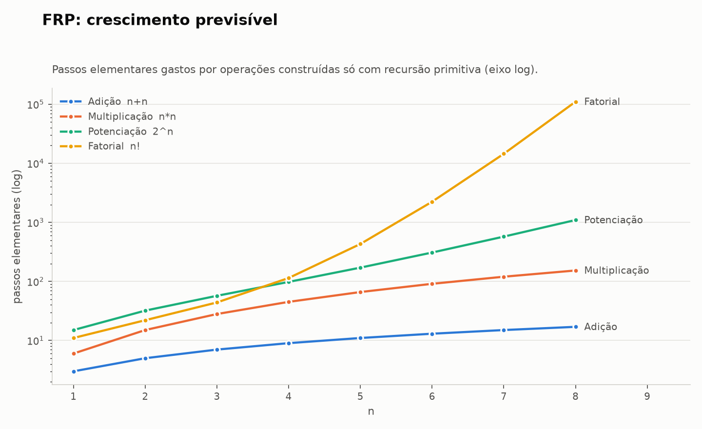
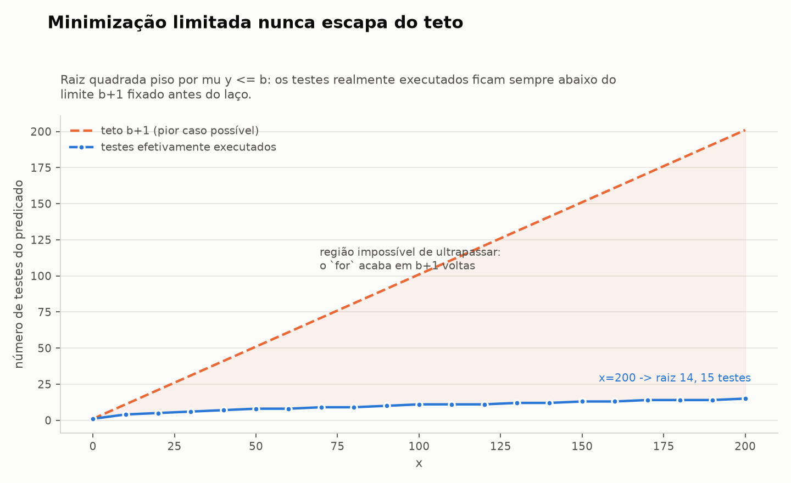
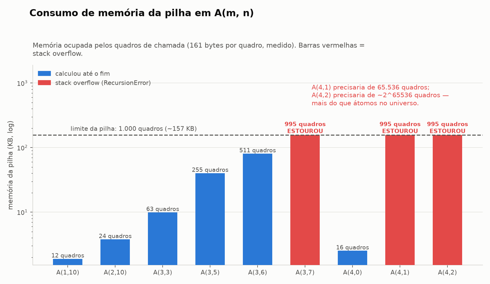
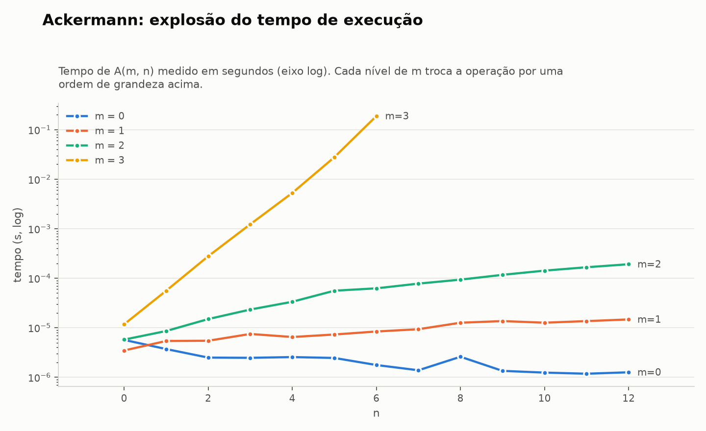
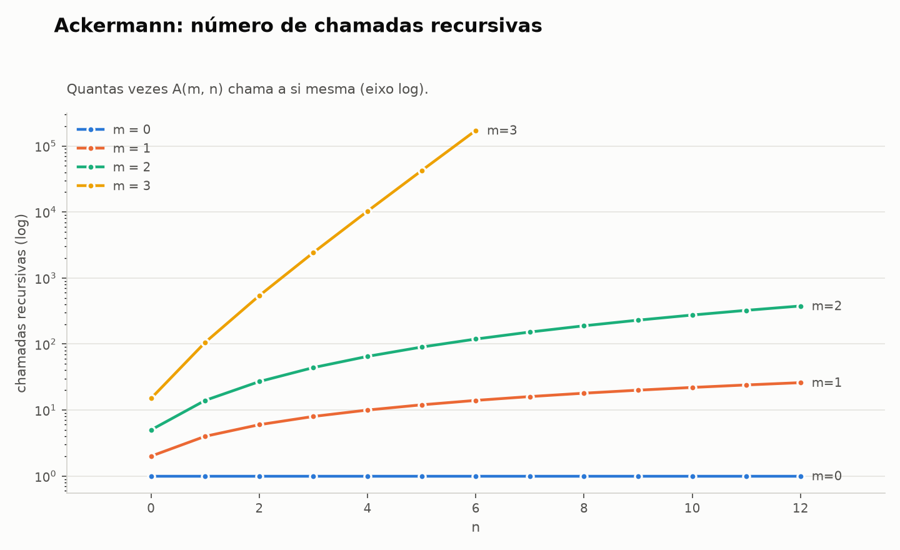
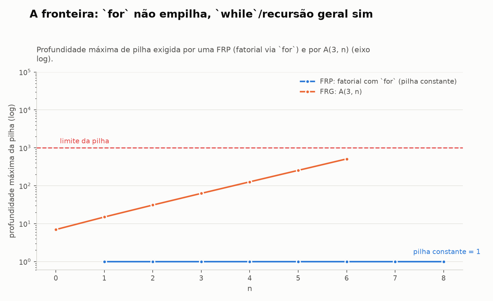

# O Limite do laço `for` vs. `while`: a fronteira entre FRP e FRG

Implementação em Python de Funções Recursivas Primitivas (FRP), Funções
Recursivas Gerais (FRG) e um benchmark que mostra a Função de Ackermann
estourando a pilha com entradas de um dígito.

## Como rodar

```bash
python3 -m venv .venv
.venv/bin/pip install matplotlib
.venv/bin/python main.py
```

Tudo é gerado localmente: os gráficos vão para `./graficos` (PNG) e o relatório
sai no terminal. Leva ~9 segundos.

## Arquivos

| Arquivo | Conteúdo |
|---|---|
| `frp.py` | Módulo FRP: funções básicas, operadores, aritmética, minimização limitada |
| `frg.py` | Módulo FRG: Ackermann e minimização não-limitada |
| `benchmark.py` | Medição (tempo, chamadas, pilha) e geração dos gráficos |
| `main.py` | Roda tudo e imprime o relatório |
| `graficos/` | Os 6 gráficos em PNG |

## 1. Módulo FRP — só laços `for`

**Funções básicas**

- `Z(x) = 0` — zero
- `S(x) = x + 1` — sucessor
- `P(n, i)` — projeção $P_i^n(x_1,\dots,x_n) = x_i$

**Operadores**

- `composicao(f, g1..gk)` → $h(\vec{x}) = f(g_1(\vec x),\dots,g_k(\vec x))$
- `recursao_primitiva(f, g)` → $h(\vec x,0)=f(\vec x)$, $h(\vec x,y{+}1)=g(\vec x,y,h(\vec x,y))$

O ponto central do trabalho está na implementação do operador:

```python
def h(*args):
    x, y = args[:-1], args[-1]
    r = f(*x)
    for i in range(y):          # LAÇO LIMITADO: exatamente y voltas
        r = g(*x, i, r)
    return r
```

`y` já é um número concreto quando o laço começa. Não existe condição de
continuação para reavaliar — é um `for`, não um `while`.

**Aritmética construída só com esses tijolos**

```
soma(x, 0)   = P_1^1(x)                    soma(3, 4)  = 7
soma(x, y+1) = S(P_3^3(x, y, r))
mult(x, y+1) = soma(mult(x, y), x)         mult(6, 7)  = 42
pot(x, y+1)  = mult(pot(x, y), x)          pot(2, 10)  = 1024
fat(y+1)     = mult(S(y), fat(y))          fatorial(6) = 720
```

E os predicados (também FRP): `predecessor`, `sub` (subtração truncada),
`sinal`, `maior`.



Cada operação cresce mais rápido que a anterior — adição < multiplicação <
potenciação < fatorial — mas **todas com custo calculável de antemão**. Nenhuma
delas escapa do controle: são só `for` aninhados.

## 2. Minimização limitada e a raiz quadrada piso

$$\mu y \le b\ [P(\vec x, y)]$$

```python
def minimizacao_limitada(predicado, b, *x):
    for y in range(b + 1):      # no máximo b+1 testes
        if predicado(*x, y):
            return y
    return b + 1                # convenção: "não achou"
```

Aplicada à raiz quadrada piso:

$$\lfloor\sqrt{x}\rfloor = \mu y \le x\ [(y+1)^2 > x]$$

O limite $b = x$ é seguro porque $(x+1)^2 > x$ para todo natural $x$ — a
resposta sempre cabe dentro do intervalo.

| x | ⌊√x⌋ | testes feitos | teto b+1 |
|---:|---:|---:|---:|
| 15 | 3 | 4 | 16 |
| 16 | 4 | 5 | 17 |
| 99 | 9 | 10 | 100 |
| 1000 | 31 | 32 | 1001 |



A linha tracejada é o teto $b+1$; a linha cheia é o que realmente foi gasto. A
distância entre as duas é o "seguro" que o `for` cobra: mesmo no pior caso
imaginável, o laço acaba.

## 3. Módulo FRG — laços indefinidos

**Função de Ackermann**

$$A(0,n)=n+1,\quad A(m,0)=A(m-1,1),\quad A(m,n)=A(m-1,A(m,n-1))$$

Ela é **total** (toda entrada tem resposta), mas **não é primitiva recursiva**:
cresce mais rápido que qualquer FRP. Nenhum `for` de profundidade fixa a
calcula — a recursão é aninhada e cada nível vira um quadro de pilha.

**Minimização não-limitada**

```python
y = 0
while True:                     # LAÇO INDEFINIDO
    if predicado(*x, y):
        return y
    y += 1
```

`μy [y² ≥ 1000]` acha 32 e para. `μy [y² = 2]` roda para sempre — o programa
não trava por bug, trava por definição. É precisamente isso que a versão
limitada torna impossível.

## 4. Benchmark: o estouro de pilha

O limite de pilha usado é `sys.setrecursionlimit(1000)` — o **valor padrão do
CPython**, a pilha real de qualquer programa Python comum. Cada quadro de
chamada foi medido em ~161 bytes (RSS/profundidade).



| caso | profundidade da pilha | memória | resultado |
|---|---:|---:|---|
| A(1,10) | 12 | 1,9 KB | 12 |
| A(2,10) | 24 | 3,8 KB | 23 |
| A(3,3) | 63 | 9,9 KB | 61 |
| A(3,5) | 255 | 40,1 KB | 253 |
| A(3,6) | 511 | 80,5 KB | 509 |
| **A(3,7)** | 995 | 156,7 KB | **STACK OVERFLOW** |
| A(4,0) | 16 | 2,5 KB | 13 |
| **A(4,1)** | 995 | 156,7 KB | **STACK OVERFLOW** |
| **A(4,2)** | 995 | 156,7 KB | **STACK OVERFLOW** |

Note o absurdo: `A(4,0)` custa 16 quadros; `A(4,1)` precisaria de **65.536**; e
`A(4,2) = 2^65536 − 3` precisaria de cerca de $2^{65536}$ quadros — um número
com ~19.729 dígitos, mais do que átomos no universo observável. Entre a segunda
e a terceira coluna da tabela de Ackermann não há "um pouco mais de memória":
há uma parede.




Cada incremento de `m` troca a operação inteira por uma ordem acima
(sucessor → soma → multiplicação → exponenciação → torre de potências), e isso
aparece como uma reta em escala logarítmica.



## 5. Por que a minimização limitada nunca entra em loop infinito

```python
for y in range(b + 1):
    if P(x, y): return y
return b + 1
```

1. **O limite `b` é calculado antes do laço começar**, por uma função que já é
   FRP (logo total). Quando o `for` inicia, o número de voltas já está escrito
   na pedra: `b + 1`.
2. **Nada dentro do corpo altera esse número.** Não há condição de continuação
   sendo reavaliada a cada volta; o contador só cresce e `range(b+1)` é finito.
3. **O conjunto {0,…,b} é finito** e cada elemento é visitado uma única vez.
   Logo o laço termina em no máximo `b+1` passos — inclusive no pior caso, em
   que `P` nunca é verdadeiro (aí devolvemos `b+1`).
4. **Existe uma cota explícita de custo:**
   $\text{custo}(\mu y \le b) \le (b+1)\cdot\text{custo}(P)$.
   Como `P` é total e `b` é total, a composição é total. Ou seja: a classe FRP é
   **fechada** por minimização limitada — por isso `raiz_quadrada_piso`
   continua sendo FRP.

Essa é a correspondência exata com o laço `for`:

| | número de voltas | garante parada? | classe |
|---|---|---|---|
| `for y in range(b+1)` | conhecido antes de começar | **sim** | FRP |
| `while cond` | decidido volta a volta | **não** | FRG |

A minimização não-limitada (`μy`) é justamente o operador que adiciona o
`while` ao repertório. Ele dá poder expressivo — permite escrever tudo que é
computável, Ackermann inclusive — e cobra por isso a perda da garantia de
parada. O gráfico `05_ackermann_memoria.png` é o preço aparecendo na conta:
entradas de um dígito, memória esgotada.
